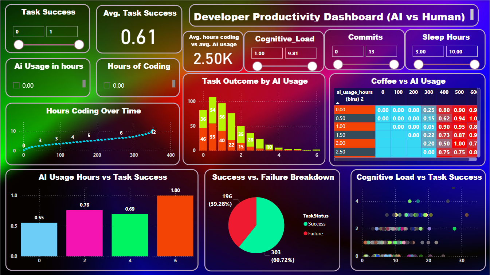

# 🧠 Developer Productivity AI: Behavioral & Performance Analysis

A complete data science project analyzing **developer productivity** using AI tools like **ChatGPT** and **GitHub Copilot**. This study explores how behavioral, physiological, and technical metrics impact productivity over **500 days** of simulated dev activity.

---

## 🗂️ Project Files

### 1. **Developer Productivity AI Analysis**
- **Description:** Data-driven exploration of modern developer performance influenced by distractions, caffeine, sleep, AI usage, and mental load.
- **Files:**
  - `Developer_Productivity_AI.ipynb` – Main Python notebook (EDA, ML models)
  - `ai_dev_productivity.csv` – Dataset of 500 days of developer activity
  - `Developer Productivity Dashboard.pbit` – Interactive Power BI dashboard
  - `productivity_ai_vs_human.png` – Preview image of AI vs Human productivity dashboard

---

## ✅ Data Source

A custom dataset simulating real-world behavioral and productivity data, capturing:
- ⏱️ Coding hours  
- ☕ Coffee intake  
- 🛌 Sleep hours  
- 📵 Distractions  
- 🧠 Cognitive load  
- 🐞 Bugs reported  
- ✅ Task success (binary target)  
- 🤖 AI tool usage (ChatGPT, Copilot)

---

## 🌟 Project Highlights

- 🔍 **Exploratory Data Analysis** of behavioral patterns
- 📈 **Regression**: Predict developer cognitive load
- 🧪 **Classification**: Predict daily task success
- 📊 **Clustering**: Identify productivity archetypes
- 📌 **Power BI dashboard** for visual comparisons between AI-assisted vs non-AI developers
- 🔬 Insights into how AI changes developer work habits and outcomes

---

## 🔧 Tech Stack

- **Python** (EDA, ML modeling via Jupyter Notebook)
- **Power BI** (Visual dashboard & reporting)
- **Pandas**, **Seaborn**, **Scikit-learn** (data wrangling & modeling)
- **Matplotlib**, **Plotly** (visualizations)
- **Markdown** (Project documentation)

---

## 🚀 How to Use

1. Clone or download this repository.
2. Open the notebook `Developer_Productivity_AI.ipynb` using Jupyter or Google Colab.
3. Explore the dataset (`ai_dev_productivity.csv`) or try your own.
4. Open `Developer Productivity Dashboard.pbit` in Power BI Desktop to interact with visual insights.
5. View the dashboard preview image for a snapshot.

---

## 📸 Dashboard Preview

<h3 align="center">📊 AI vs Human Developer Productivity Dashboard</h3>

  

---

## 📌 Key Takeaway

This project highlights how AI is reshaping the software development workflow — from reducing mental load to influencing success outcomes. It's a step toward building **smarter**, not just faster.

---

